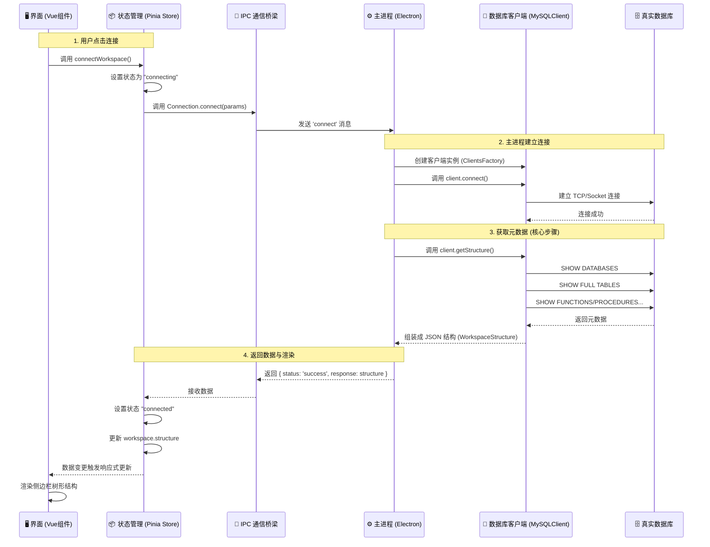

# Antares 数据库连接流程分析

本文档详细描述了在 Antares 客户端中点击“连接”按钮后的内部执行流程，涵盖从前端 UI 触发到后端数据库交互的全过程。

## 📊 流程时序图



## 📝 详细步骤解析

### 1. 前端触发 (Renderer Process)
*   **文件**: `src/renderer/stores/workspaces.ts`
*   **动作**: 用户点击连接后，触发 `workspace` store 中的 `connectWorkspace` 方法。
*   **逻辑**:
    *   将当前工作区连接状态标记为 `connecting`（界面显示加载转圈）。
    *   准备连接参数（主机、端口、用户、密码等）。
    *   通过 `Connection.connect` 发起异步请求。

### 2. IPC 通信桥梁
*   **文件**: `src/renderer/ipc-api/Connection.ts`
*   **动作**: 渲染进程通过 Electron 的 `ipcRenderer.invoke('connect', params)` 向主进程发送消息。
*   **作用**: 这是前端 UI 与后端 Node.js 能力的边界。

### 3. 主进程处理 (Main Process)
*   **文件**: `src/main/ipc-handlers/connection.ts`
*   **监听**: 主进程监听到 `connect` 事件。
*   **逻辑**:
    *   **验证**: 检查请求来源是否合法。
    *   **工厂模式**: 使用 `ClientsFactory` 根据数据库类型（如 MySQL）创建对应的客户端实例。
    *   **执行**: 调用客户端实例的 `connect()` 和 `getStructure()` 方法。

### 4. 数据库交互与元数据提取 (MySQL Client)
这是最关键的一步，决定了你看到什么信息。
*   **文件**: `src/main/libs/clients/MySQLClient.ts`
*   **方法**: `getStructure(schemas)`
*   **执行的 SQL 查询**:
    1.  **获取数据库列表**: `SHOW DATABASES`
    2.  **获取函数/过程**: `SHOW FUNCTION STATUS`, `SHOW PROCEDURE STATUS`
    3.  **获取触发器**: `SHOW TRIGGERS`
    4.  **获取表和视图**: 遍历每个数据库，执行 `SHOW FULL TABLES FROM <db_name>`
    5.  **获取调度器**: 查询 `information_schema.EVENTS`

    > **注意**: 这一步会把所有查到的数据组装成一个巨大的 JSON 对象，包含数据库名、表名列表、对象类型等，但**不包含**表内的具体数据（行记录）。

### 5. 数据返回与 UI 渲染
*   **数据流回**: 巨大的 JSON 对象（`structure`）通过 IPC 返回给前端 Store。
*   **状态更新**:
    *   `workspaces.ts` 将 workspace 的状态改为 `connected`。
    *   将获取到的 JSON 赋值给 `workspace.structure`。
*   **界面渲染**:
    *   **文件**: `src/renderer/components/WorkspaceExploreBar.vue`
    *   这是一个 Vue 组件，它监听 `structure` 数据的变化。
    *   使用 `v-for` 循环遍历数据，在左侧侧边栏渲染出数据库 -> 表/视图/函数 的树形结构。

## 📂 核心数据结构

前端拿到的数据结构 (`WorkspaceStructure`) 示例：

```json
[
  {
    "name": "my_database",
    "size": 102400,
    "tables": [
      { "name": "users", "type": "table", "rows": 100 },
      { "name": "orders", "type": "table", "rows": 50 }
    ],
    "functions": [],
    "procedures": [],
    "triggers": [],
    "schedulers": []
  },
  {
    "name": "another_db",
    ...
  }
]
```
